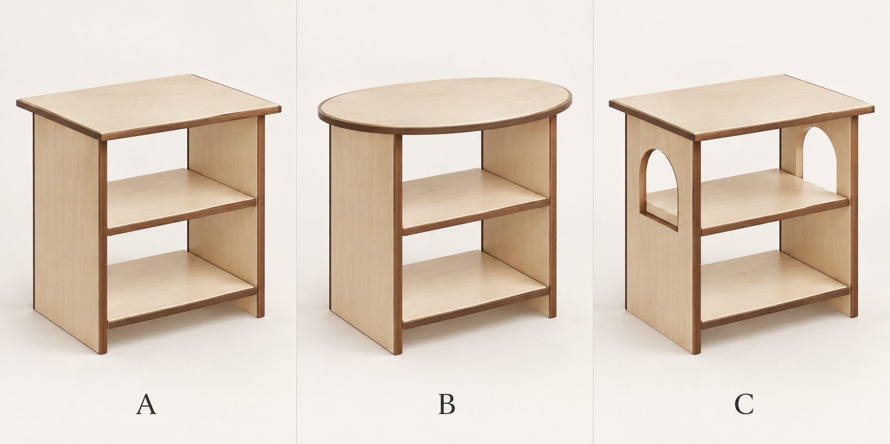

# S01 · 板式支撐與曲線探索

2026-09-10 · **L0 造型研究，非 CAD／非定案。D06 未替換。**

- A：方形桌面＋板式側支撐基準。AI 板腳仍偏滿、內縮不足，比較像小書架；不是最後的內縮板腳方案。
- B：相近支撐，桌面改橢圓（維持寬深不等的方向，不是正圓）。較柔和，但單改桌面沒有完全解決下半部的方正。
- C：方形桌面＋上半側板拱形鏤空。弧線直接改變支撐留白，識別度較強，但具象拱窗容易成為過度裝飾。

## 下一步值得比較
保留 C 的「弧線作用在負空間」原則，未必照用完整拱窗；可改較低、較寬或只在板腳下緣做弧切。先選方向，再以 CAD 檢查內縮、層板托持與穩定性。不要一次疊加圓桌面、拱洞和格柵。

## 材料與邊界
淺色指定乳白淡紋楓木；深色僅胡桃木細周邊條。照片木種與原作外觀不是本案材料規格。原本雙層托盤在這張 AI 圖被簡化，不能當作已保留幾何或構造。所有承托、弧口邊框寬度、貼皮／彎曲收邊工法皆待確認。

使用內建 image_gen。完整 prompt 與輸入／輸出 SHA256 已保存於 prompt.txt、manifest.json。reference/ 僅保留研究來源，未發布到 Pages。
