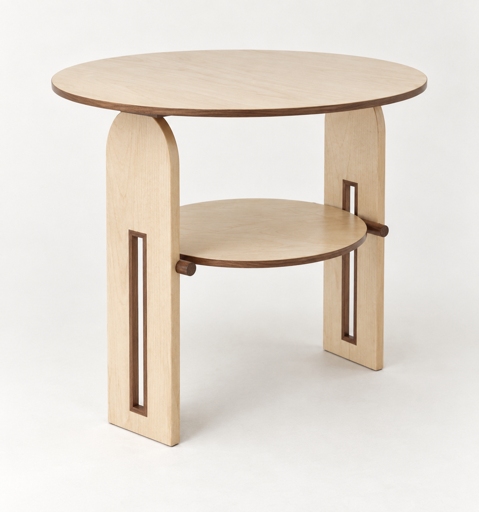

# S02 · 圓桌／楓木拱頂板腳／胡桃木框縫

**L0 造型研究，未替換 D06、未發布 Pages，非施工圖。**

## 本輪使用者指定
圓桌；細拱門型楓木腳；中央細長方形鏤空至半高；四周貼合胡桃木飾條；板凳式胡桃木細支撐桿承托額外一層；整體微懸浮。

## 初稿解讀／假設
- 「拱門型」先解讀成薄板脚的**外輪廓拱頂**，中央洞口仍為**直角長矩形**，不是把洞畫成拱洞。兩組相對板腳，內縮於圓桌邊。
- 桌面＋小一圈的下層，共兩層，不沿用之前三層。圓桌600、小層440、高600僅為產圖比例假設，待確認。
- 乳白淡紋楓木為主，胡桃木只用在洞口四邊細框、支撐細桿與圓桌周邊。
- 懸浮感来自桌面外挑、支撐內縮、接點陰影；不應以真正無承托的空隙製造效果。

## 看圖檢查
本張符合外輪廓拱頂／矩形框縫／兩層的方向；板脚仍偏完整面，不是細條彎成的U形腳。洞高比例與正圓形狀不可由AI圖量測。支撐桿的完整走向、層板防滑／防抬、頂部連接與抗傾倒未定，不能因圖上看似接觸就宣稱結構成立。

內建 image_gen 生成，完整 prompt.txt 與 manifest.json 保存來源和hash。原研究S01和目前D06保持不變。
