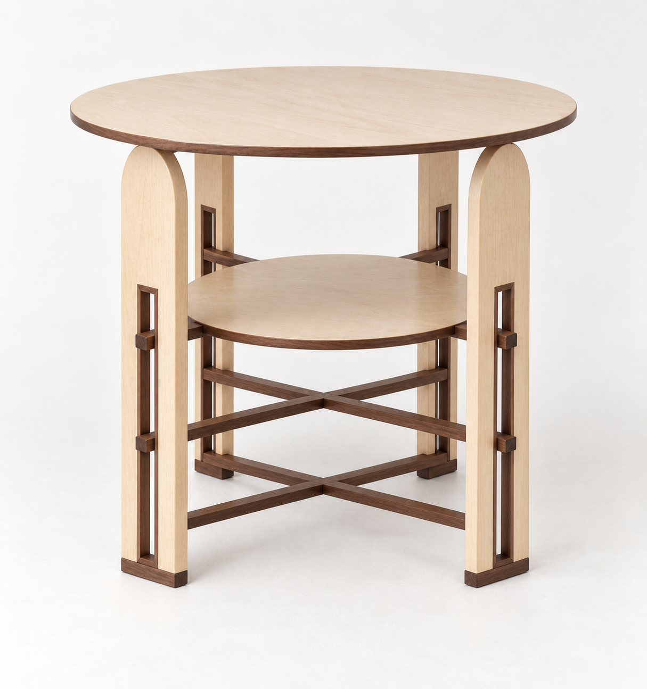

# S03 · 四隻拱頂楓木腳／三層水平 X

**L0 造型研究，非施工圖；D06 不變，未發布 Pages。**

## 使用者修正
- 支撐改成四隻楓木拱頂板腳，非 S02 的兩隻。
- 中央細長方形槽口一路到最底部，不留楓木底檻；每隻脚以橫向胡桃木飾條／腳墊收底。
- 胡桃木細桿穿過相對腳的槽口；每個高度兩根交叉，三個高度共三組 X／六根細桿。
- 最上層 X 托第二層小圓桌面。加上主圓桌面，共兩層。

## 本稿明確解讀
X 是俯視的交叉，三組位於三個水平面，不是立面的斜撑。腳先安排在內縮正方形的四角，兩方向細桿各沿對角線連接相對腳。腳外輪廓拱頂，窄槽仍是直角矩形；長槽下端由胡桃木腳墊收口。

## 視覺檢查
圖中四腳／四個腳墊可辨識，長槽開至胡桃木底條；下方兩組X的交叉中心露出，上層X部分被圓桌面遮住。部分細桿出頭被腳／桌面遮擋，AI不能證明六根桿的完整連續性與半搭接已正確。

## 待工程化
三組X中央如何交接、穿槽桿端固定、半搭接減薄強度、腳墊固定／腳叉抗裂、第二層板防滑防抬、主桌面頂部承托、偏載與抗搖均未驗證。尺寸和實際槽高不是圖片中的已知數據。懸浮感來自內縮與外挑，不能以真正無承托代替。

內建 image_gen，完整 prompt.txt、manifest.json 保存輸入／輸出與hash。
