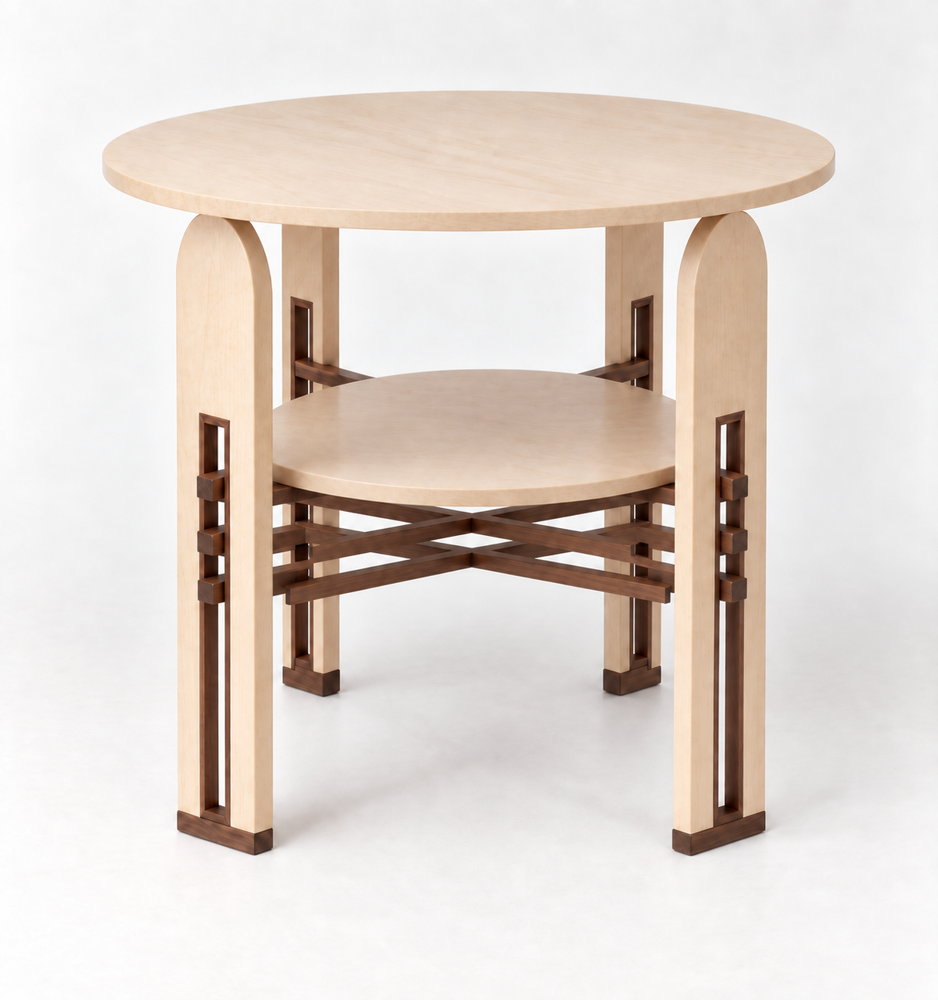

# S04 · 緊密三層 X／全楓木實木圓桌面

**造型基準候選。使用者表示本輪調整後架構接近定案，後續以微調為主；不等於生產批准。**

## 這次鎖定的設計關係 [KNOWN：使用者要求]
- 四隻楓木拱頂板腳；中央長矩形槽開到底，由胡桃木橫向腳墊收底。
- 槽口胡桃木細飾條，三層水平 X，每層兩根，穿入對向槽。
- 三層 X 集中在第二層桌面正下方，最高 X 托桌面。**淨間隙＝飾條高度**，不是中心距等於高度。
- 上下兩片圓桌面全楓木實木，不用胡桃木弧形收邊，不使用貼皮。胡桃木只留槽飾條、交叉細桿及腳墊。

## 後續 CAD 的參數規則
令細桿高為 h、第二層桌面底高為 s：
- 層間淨空 h；中心／底面節距 2h。
- 三組 X 總高 5h。
- 由上往下，各組 X 底高 s−h、s−3h、s−5h。
- 上述假設每组 X 中心用齊平半搭接，總高只有 h；若改成上下疊接，需重算，不可悄悄增加厚度。

產圖曾以14 mm作示例，**不是定案尺寸**。精確1:1比例寫在 design_constraints.json；AI畫面不具尺寸精度。初圖間隙過窄，已用單一間距修正prompt重做，紀錄完整保留。

## 工程尚未完成
圓桌直徑、板厚、腳距、桿截面與公差未鎖定。全實木桌面須設計容許木材活動的固定方式；不得直接將大面實木剛性膠死在交叉架上。中央接合、桿端防拔、腳叉抗裂、腳墊連接、頂面承托、偏載與抗搖均待CAD／實物驗證；本稿不提供可承載重量。

## 檔案與版本
內建 image_gen 生成。完整prompt及修正prompt、來源hash見manifest.json。現有D06 CAD／Pages未變；S04為後續建模的新造型基準，不把D06舊構造當成已同步。
