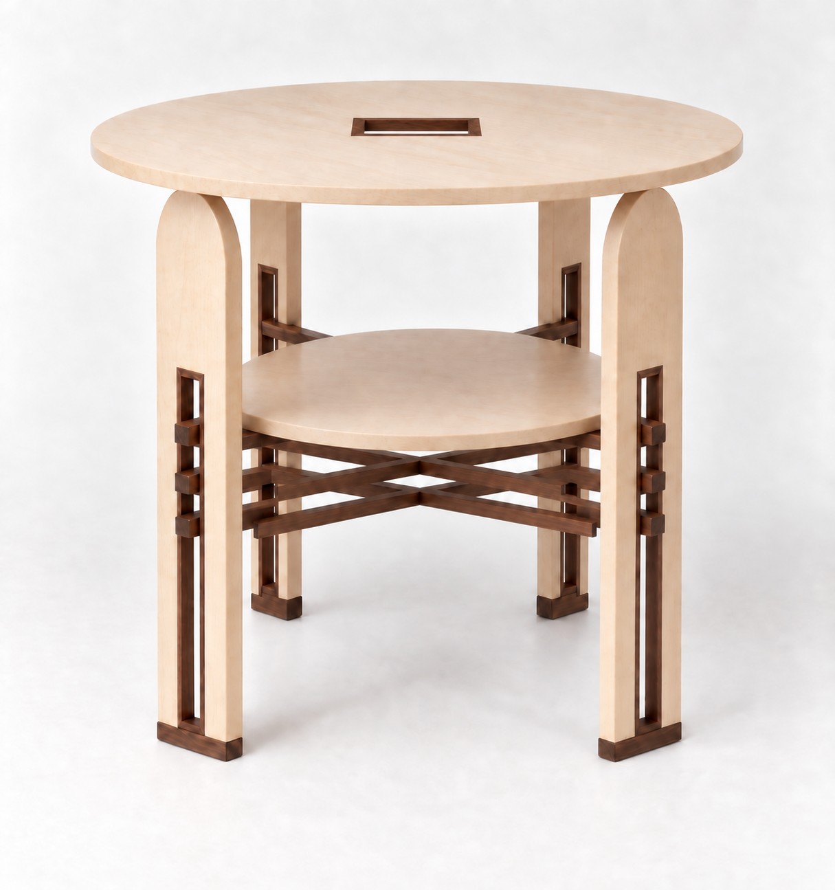
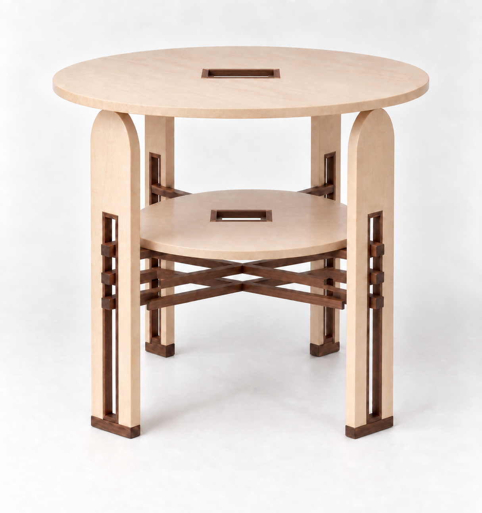

# S05 · 胡桃木框長矩形把手孔：兩張微調稿

**L0 AI 外觀比較；S04造型基準、D06 CAD及Pages不變。**

## ① 僅上桌面

上方楓木實木圓板中心開窄長矩形孔，四邊嵌胡桃木細飾條，中央保持開口；下層完整。

## ② 上下桌面

上下圓板中心皆作相同語彙的長矩形胡桃木框孔。

## 未定尺寸與功能限制
產圖採約110×30mm淨孔、5mm飾條作比例參考，均為[ASSUMED]，不是已選定把手尺寸。圖片不能保證兩孔等大、1:1 X間隙或原相機完全不變。下層中心對應最上組X的交叉點，手指伸入空間可能被擋；不得把AI圖中的白色空隙當成無干涉證據。若要實際握持，須CAD剖面確認淨空、邊角、孔邊強度與固定方式；若要搬整張桌，更需確認桌面與架體防拔接合，不能直接宣稱可提起。

內建image_gen，完整兩份prompt保存在prompts.json，輸入／輸出與hash見manifest.json。本輪仅加矩形孔胡桃木框；圓周保持楓木，不增加胡桃木弧邊，不採貼皮。
